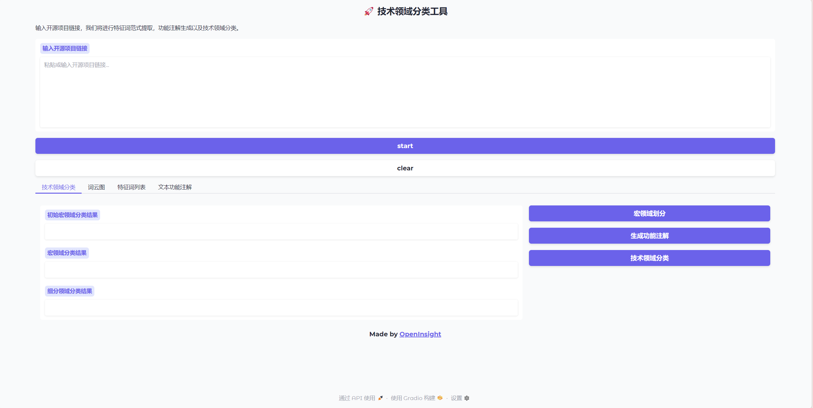
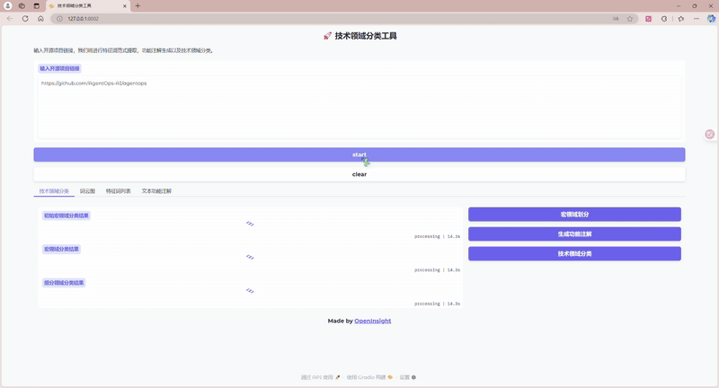
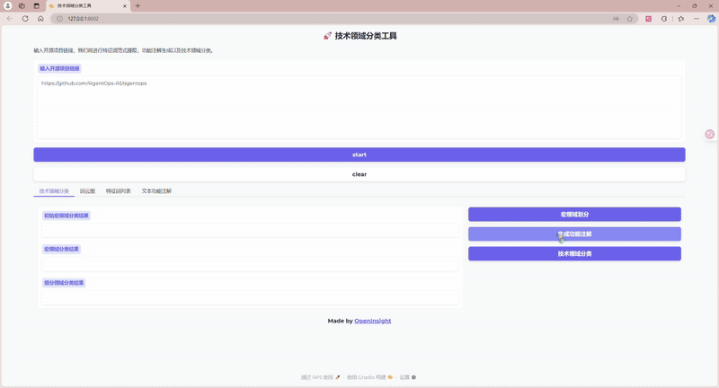
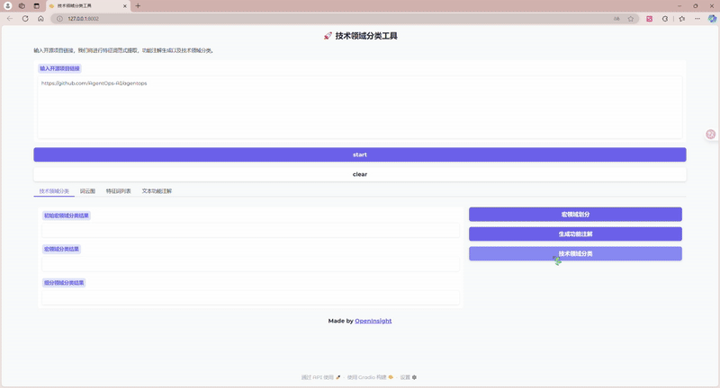

# open_insight
本项目主要针对开源项目的技术领域进行划分，构建了多智能体的划分方式，包括特征词范式生成智能体、特征词范式聚类智能体、特征词范式分类智能体等。通过这些智能体，可以实现对开源项目的技术领域进行自动化的划分和分析，从而为开源项目的管理和维护提供支持。
目前主要支持 AI 领域的技术划分，采用模型为 Qwen3-8B，后续会增加更多的模型支持。

# 使用说明

```bash
# 克隆项目仓库
git clone https://github.com/yourusername/open_insight.git
cd open_insight
```
## 创建环境
```bash
# 推荐使用conda创建虚拟环境
conda create -n open_insight python=3.12.3
conda activate open_insight
pip install -r requirements.txt
```
## 配置结果目录、API密钥、url

在 `src/feature_extract/document_metric/config.ini` 文件中添加您想要保存至的目录、API 密钥以及 url：

```ini
[GLOBAL_PATHS]
tmp_path = 

[OPEN_CHECKService]
#gitee url
openai_api_key = YOUR_API_KEY_HERE

;osscompass all data url
open_search_url_metadata = 

;osscompass topics url
open_search_url_topics = 

```

请将 `YOUR_API_KEY_HERE` 替换为实际的 API 密钥。

此外，还需要解决 config 文件的编码问题。请确保您的 config 文件编码为 utf-8，并且确保文件中没有 BOM 头。

## 使用项目

### 在命令行使用

运行 `main.py`，同时传入开源项目链接以及版本号（可选）：

`python main.py {repo_url} {version}`

比如：`python main.py https://github.com/AgentOps-AI/agentops 0.4.13`
或者 `python main.py python main.py https://gitee.com/dromara/easyAi v1.4.9`
或者 `python main.py https://gitee.com/dromara/easyAi`

### 在 gradio 图形化页面使用

运行 `demo.py`，将在本地 8002 端口 启动 gradio 服务，在浏览器打开 http://127.0.0.1:8002/

您会看到如下页面：



#### start 全部开始

在上方文本框输入您想处理的开源项目链接。点击 `start`，会开始处理，处理完成后将在下方各个板块显示详细结果：



#### 宏领域划分

点击下方右侧 `宏领域划分` 按钮，会开始进行宏领域划分，处理完成后将显示结果：


#### 生成功能注解

点击下方右侧 `生成功能注解` 按钮，会开始进行功能注解，点击文本功能注解版块显示进度，处理完成后将显示结果：



#### 技术领域分类

点击下方右侧 `技术领域分类` 按钮，会开始进行技术领域分类，处理完成后将显示结果：



# 联系我们

如果您有任何问题或建议，请通过以下方式联系我们：

邮箱：zyx72038@gmail.com