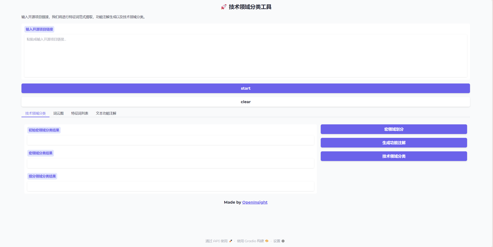
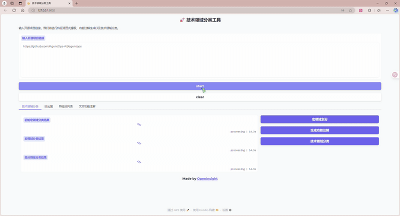
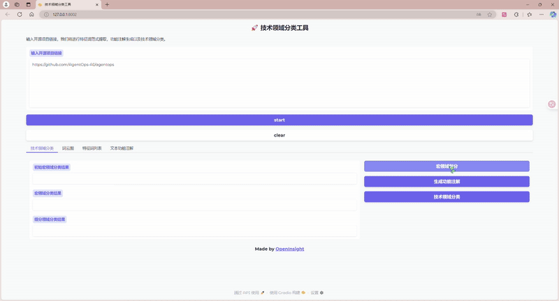
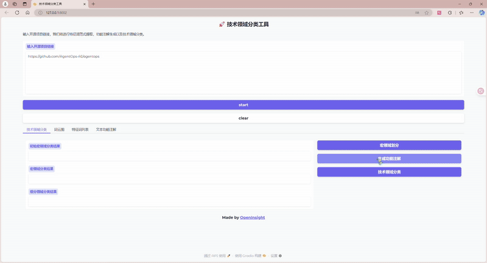
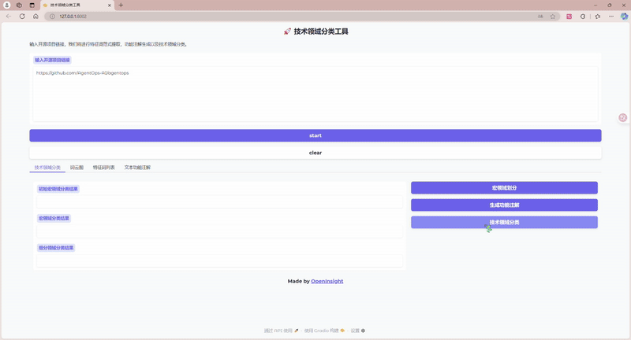

# open_insight

This project mainly targets the division of technical fields of open source projects, and constructs a multi-agent division method, including Feature Word Paradigm Generation Agent, Feature Word Paradigm Clustering Agent, Feature Word Paradigm Classification Agent, etc. Through these agents, automated division and analysis of technical fields of open source projects can be achieved, thereby providing support for the management and maintenance of open source projects.

Currently, it mainly supports technical division in the AI field, using the Qwen3-8B model, and more model support will be added in the future.

# Usage Instructions

```bash
# Clone the project repository
git clone https://github.com/yourusername/open_insight.git
cd open_insight
```


## Create Environment

```bash
# It is recommended to use conda to create a virtual environment
conda create -n open_insight python=3.12.3
conda activate open_insight
pip install -r requirements.txt
```


## Configure Result Directory, API Key, and URL

Add your desired save directory, API key, and URL in the `src/feature_extract/document_metric/config.ini` file:

```ini
[GLOBAL_PATHS]
tmp_path = 

[OPEN_CHECKService]
#gitee url
openai_api_key = YOUR_API_KEY_HERE

;osscompass all data url
open_search_url_metadata = 

;osscompass topics url
open_search_url_topics = 

```


Please replace `YOUR_API_KEY_HERE` with the actual API key.

## Using the Project

### Using from Command Line

Run [main.py](file://E:\se_homework\open_insight\main.py), passing in the open source project link and version number (optional):

`python main.py {repo_url} {version}`

For example: `python main.py https://github.com/AgentOps-AI/agentops 0.4.13`

### Using the Gradio GUI

Run [demo.py](file://E:\se_homework\open_insight\demo.py), which will start the gradio service on local port 8002. Open http://127.0.0.1:8002/ in your browser.

You will see the following page:



#### start 全部开始

Enter the open source project link you want to process in the text box above. Click `start` to begin processing. After completion, detailed results will be displayed in the various sections below:



#### 宏领域划分

Click the `宏领域划分` button at the bottom right to start macro field division. After completion, the results will be displayed:



#### 生成功能注解

Click the `生成功能注解` button at the bottom right to start functional annotation. Click on the text functional annotation section to show progress. After completion, the results will be displayed:



#### 技术领域分类

Click the `技术领域分类` button at the bottom right to start technical field classification. After completion, the results will be displayed:



# Contact Us

If you have any questions or suggestions, please contact us via the following methods:

Email: zyx72038@gmail.com